<!-- Animated wave header -->

<!-- Typing SVG -->

 

 

## 🧭 About Me

I'm a Computer Science undergrad at **Chitkara University** (CGPA 9.28), focused on building high-performance, product-minded web applications. I like intentional full-stack development — clean RESTful APIs, tuned databases, and frontends that actually feel good to use. Currently deep in Java + DSA practice, and always looking for the next interesting thing to build.

 

## 🏆 Featured Achievements

<table>
<tr>
<td align="center" width="50%">
<h4>🍎 Apple Swift Student Challenge 2026</h4>

<b>Winner</b> — recognized for excellence in application development and creative problem-solving.

🎧 Prize: AirPods Max
<!-- If you want your prize photo here, upload it into an /assets folder in this repo
     and reference it like: 
     Relative paths only work once the file actually lives in this repo. -->
</td>
<td align="center" width="50%">
<h4>🚀 Google Big Code Hackathon 2025</h4>

Qualified for <b>Round 2</b> — strong competitive programming & algorithmic problem-solving.

</td>
</tr>
<tr>
<td align="center">
<h4>🧠 100+ DSA Problems Solved</h4>

Across LeetCode & GeeksforGeeks.

</td>
<td align="center">
<h4>🎓 9.28 CGPA</h4>

B.E. Computer Science, Chitkara University — consistently 90%+ in foundational academics.

</td>
</tr>
</table>

 

## 💻 Tech Stack

**Languages**
 

**Backend**
 

**Frontend**
 

**Databases & Cloud**
 

 

## 🚀 Highlighted Projects

<table>
<tr>
<td width="50%" valign="top">

### 🧠 Online Quiz System
Full-stack interactive quiz platform with a dynamic React frontend and Node.js backend.
- Architected a **GraphQL** server to optimize client-database data fetching, reducing load time
- Integrated an **AI-driven chat component** for real-time in-quiz assistance
- Built **3D animations in Blender** to boost engagement

`React` `Node.js` `GraphQL`

</td>
<td width="50%" valign="top">

### 🤝 SyncUp — Team Collaboration Platform
Real-time communication platform with dedicated workspaces and direct messaging.
- Scalable Node.js backend handling secure auth across **concurrent multi-workspace sessions**, zero downtime
- Efficient state management for seamless channel/chat navigation

`React` `Vite` `Node.js`

</td>
</tr>
</table>

➕ More projects (click to expand)

 

- **Hand-Tracking AR Particle Overlay** — Browser-based AR experience using `Human.js` and canvas, with two-hand landmark tracking, pinch gestures, and real-time particle effects.
- **3D Orbiting Photo Gallery** — Interactive gallery built with `React`, `Three.js`, `@react-three/fiber`, and `@react-three/drei`.
- **Vaani Bot** — Hindi/Telugu interactive voice assistant built for Sankar Group using the Web Speech API, Claude API, and browser speech synthesis, with multi-turn memory.

 

## 📊 GitHub Stats

> These cards are generated by GitHub Actions running inside this repo (see `.github/workflows/profile-cards.yml`) — not fetched from a public third-party server, so they don't randomly go down like the generic ones do.

 

 

## 🐍 Contribution Snake

> A snake that eats its way through my real contribution graph, regenerated every 6 hours by `.github/workflows/snake.yml`. Most profiles don't bother wiring this up — it's a nice one to have.

<picture>
  <source media="(prefers-color-scheme: dark)" srcset="https://raw.githubusercontent.com/PrabhsimranKaur11/PrabhsimranKaur11/output/snake-dark.svg" />
  <source media="(prefers-color-scheme: light)" srcset="https://raw.githubusercontent.com/PrabhsimranKaur11/PrabhsimranKaur11/output/snake.svg" />
  
</picture>

 

## 📜 Certifications

<b>Click to expand — 20+ certifications</b>

 

- **Red Hat** — System Administration I (RH124)
- **Coursera** — Cybersecurity & IT Networking Foundations
- **Coursera** — Python Data Analytics
- **Coursera** — SQL Certifications
- Plus 15+ additional certifications across cloud, software development, and emerging technologies

 

### 📬 Let's Connect

If you're working on something interesting in full-stack dev, AI-integrated apps, or competitive programming — I'd love to talk.

📧 **prabhkaur1902@gmail.com**

